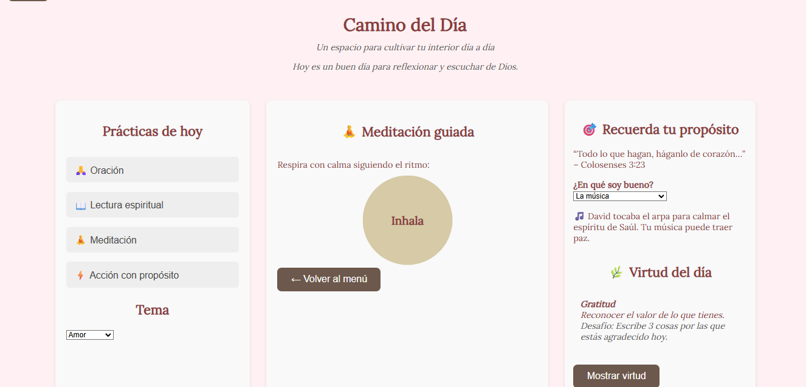

# 🌅 Camino del Día

**Camino del Día** es una aplicación liviana desarrollada en HTML, CSS y JavaScript puro, diseñada para fomentar hábitos espirituales basados en la Biblia y de reflexión interior.



## ✨ Propósito

Este proyecto busca brindar un espacio cotidiano donde las personas puedan reconectar con su propósito, cultivar su interior y practicar hábitos como:

- 🙏 Oración
- 📖 Lectura espiritual
- 🧘 Meditación guiada
- ⚡ Acciones con propósito
- 💡 Reflexión personal
- 🎯 Reconocimiento de habilidades y dones

## 🧠 Funcionalidades destacadas

- Selector temático con frases inspiradoras según el enfoque del día (amor, justicia, gratitud…).
- Registro de reflexiones diarias.
- Oración del día + opción para escribir la propia.
- Versículos bíblicos por libro.
- Meditación guiada por respiración.
- Acciones significativas diarias.
- Virtud del día (paciencia, fe, perdón…).
- Sección de “Recuerda tu propósito” con guía espiritual según tus habilidades.

## 💻 Tecnologías usadas

- HTML5
- CSS3
- JavaScript (sin frameworks)

## 🚀 Cómo ejecutarlo localmente

1. Clona el repositorio:

```bash
git clone https://github.com/AllanMartinezC/camino-del-dia.git

Abre el archivo index.html en tu navegador.

¡Y listo! No necesitas instalar nada más.

